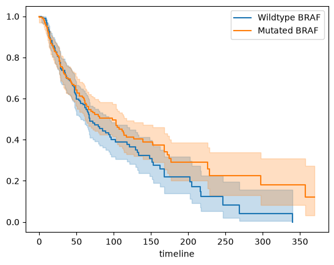
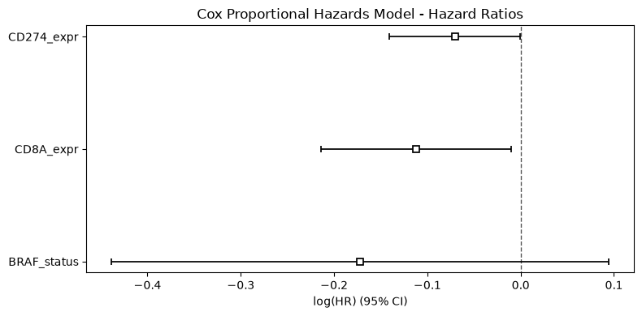

# tcga-skcm-survival-analysis
---
## Overview & Scientific Rationale
This bioinformatics project evaluates the prognostic value of selected biomarkers (`CD8A`, `CD274`/PD-L1) alongside oncogenic mutations (`BRAF`) in cutaneous melanoma using the TCGA-SKCM cohort data from the National Cancer Institute GDC Data portal.

This pipeline combines biomarker data with clinical survival outcomes to investigate how they interact in predicting overall survival against cutaneous melanoma.

---

## Key Findings
* **CD8A Expression:** Higher `CD8A` expression is significantly associated with improved survival ($\text{HR} = 0.89$), displaying an approximate 11% reduction in mortality hazard.
* **CD274 (PD-L1) Expression:** High `CD274` expression correlates with stronger survival, consistent with the expected adaptive immune response against inflamed tumors.
* **BRAF Status:** While an initial Kaplan-Meier curve plot suggested baseline survival differences for `BRAF`-mutated tumors, `BRAF` status lost independent prognostic significance ($\text{HR} = 0.84, p = 0.21$) in Cox Proportional Hazard Regression modeling when adjusting for immune biomarkers (`CD8A`, `CD274`).

---

## Key Visualizations

| Kaplan-Meier Survival Analysis | Multivariate Cox Proportional Hazards Model |
| :---: | :---: |
|  |  |

---

## Repository Structure

```plaintext
tcga-skcm-survival-analysis/
│
├── README.md
├── requirements.txt
│
├── data/
│   ├── clinical.tsv
│   ├── mutations.maf
│
├── notebooks/
│   └── skcm_survival.ipynb   <-- Notebook used for analysis
│
└── figures/
    ├── km_braf_survival.png
    └── cox_forest_plot.png
